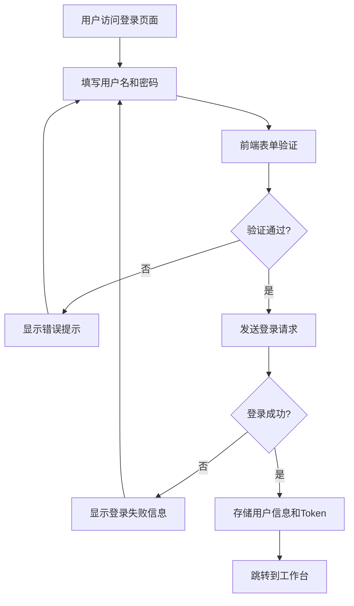

# 心理医生管理系统登录方式说明文档

## 概述

心理医生管理系统采用基于JWT Token的用户认证机制，支持医生账号登录，提供完整的用户认证、权限控制和会话管理功能。

## 登录方式

### 1. 支持的登录类型

#### 医生账号登录
- **用户类型**: 医生 (userType: 1)
- **登录入口**: `/login` 页面
- **权限范围**: 完整的系统功能访问权限

### 2. 登录凭据要求

#### 必填字段
- **用户名**: 2-20个字符，支持字母、数字、下划线
- **密码**: 6-20个字符，支持字母、数字、特殊字符
- **用户类型**: 自动设置为医生类型 (1)

#### 表单验证规则
```javascript
{
  username: [
    { required: true, message: '请输入用户名', trigger: 'blur' },
    { min: 2, max: 20, message: '用户名长度在 2 到 20 个字符', trigger: 'blur' }
  ],
  password: [
    { required: true, message: '请输入密码', trigger: 'blur' },
    { min: 6, max: 20, message: '密码长度在 6 到 20 个字符', trigger: 'blur' }
  ]
}
```

## 登录流程

### 1. 前端登录流程



### 2. 详细登录步骤

#### 步骤1: 表单验证
```javascript
// 1. Element Plus表单验证
await loginFormRef.value.validate()

// 2. 自定义空值检查
if (HaveStringPropertiesEmpty(loginForm)) {
  ElMessage.warning('请填写完整的登录信息')
  return
}
```

#### 步骤2: API请求
```javascript
// 调用登录API
const response = await login({
  username: 'doctor1',
  password: '123456',
  userType: 1
})
```

#### 步骤3: 响应处理
```javascript
if (response && response.code === 0) {
  // 登录成功
  const userData = response.data
  await store.dispatch('setUser', userData)
  ElMessage.success('登录成功')
  router.push('/dashboard')
} else {
  // 登录失败
  ElMessage.error(response?.message || '登录失败')
}
```

## 认证机制

### 1. JWT Token认证

#### Token存储
- **存储位置**: localStorage
- **存储键名**: `psychat_doctor_token`
- **存储方式**: 明文存储

#### Token管理工具
```javascript
// 获取Token
function getToken() {
  return localStorage.getItem('psychat_doctor_token')
}

// 设置Token
function setToken(token) {
  localStorage.setItem('psychat_doctor_token', token)
}

// 删除Token
function removeToken() {
  localStorage.removeItem('psychat_doctor_token')
}
```

### 2. 状态管理

#### Vuex Store结构
```javascript
state: {
  user: {
    id: null,
    userName: '',
    name: '',
    token: getToken()
  },
  loading: false
}
```

#### 用户状态操作
```javascript
// 设置用户信息
SET_USER(state, user) {
  state.user = { ...state.user, ...user }
}

// 设置Token
SET_TOKEN(state, token) {
  state.user.token = token
  setToken(token)
}

// 清除用户信息
CLEAR_USER(state) {
  state.user = { id: null, userName: '', name: '', token: null }
  removeToken()
}
```

## API接口

### 1. 登录接口

#### 接口信息
- **URL**: `/login`
- **方法**: POST
- **Content-Type**: application/json

#### 请求参数
```javascript
{
  "username": "doctor1",      // 用户名
  "password": "123456",      // 密码
  "userType": 1              // 用户类型 (1=医生)
}
```

#### 响应格式
```javascript
// 成功响应
{
  "code": 0,
  "message": null,
  "data": {
    "id": 1,
    "userName": "doctor1",
    "name": "张医生",
    "token": "eyJhbGciOiJIUzI1NiJ9..."
  }
}

// 失败响应
{
  "code": 1,
  "message": "用户名或密码错误",
  "data": null
}
```

### 2. Mock数据支持

#### 配置方式
```bash
# .env.development 或 .env.production
VITE_USE_MOCK=true   # 启用Mock数据
VITE_USE_MOCK=false  # 使用真实API
```

#### Mock登录账号
```javascript
// 测试账号
{
  username: 'doctor1',
  password: '123456',
  userType: 1
}
```

## 权限控制

### 1. 路由守卫

#### 全局前置守卫
```javascript
router.beforeEach((to, from, next) => {
  const token = getToken()
  
  // 检查是否需要登录
  if (to.meta.requiresAuth) {
    if (token) {
      next()  // 有Token，允许访问
    } else {
      next('/login')  // 无Token，跳转登录
    }
  } else {
    // 已登录用户访问登录页，重定向到工作台
    if (to.path === '/login' && token) {
      next('/dashboard')
    } else {
      next()
    }
  }
})
```

#### 受保护的路由
```javascript
// 需要登录的页面
{
  path: '/dashboard',
  meta: { requiresAuth: true }
},
{
  path: '/profile',
  meta: { requiresAuth: true }
},
// ... 其他需要认证的页面
```

### 2. HTTP请求拦截

#### 请求拦截器
```javascript
// 自动添加Token到请求头
request.interceptors.request.use(config => {
  const token = getToken()
  if (token) {
    config.headers.Authorization = token
  }
  return config
})
```

#### 响应拦截器
```javascript
// 处理认证错误
request.interceptors.response.use(
  response => response.data,
  error => {
    if (error.response?.status === 401) {
      // Token过期，清除本地存储并跳转登录
      removeToken()
      router.push('/login')
    }
    return Promise.reject(error)
  }
)
```

## 会话管理

### 1. 登录状态检查

#### Getter方法
```javascript
// 检查是否已登录
isLoggedIn: state => !!state.user.token

// 获取当前用户
currentUser: state => state.user
```

#### 使用示例
```javascript
// 在组件中使用
const store = useStore()
const isLoggedIn = computed(() => store.getters.isLoggedIn)
const currentUser = computed(() => store.getters.currentUser)
```

### 2. 自动登出

#### 触发条件
- Token过期 (HTTP 401响应)
- 用户主动登出
- Token被篡改或无效

#### 登出流程
```javascript
// 清除用户状态
store.dispatch('logout')

// 跳转到登录页
router.push('/login')
```

## 安全特性

### 1. 前端安全措施

#### 输入验证
- 用户名长度限制 (2-20字符)
- 密码长度限制 (6-20字符)
- 特殊字符过滤
- XSS防护

#### Token安全
- 自动过期处理
- 请求头自动携带
- 本地存储管理

### 2. 网络安全

#### HTTPS支持
- 生产环境强制HTTPS
- 数据传输加密

#### 跨域处理
```javascript
// Vite代理配置
server: {
  proxy: {
    '/api': {
      target: 'http://localhost:8087',
      changeOrigin: true
    }
  }
}
```

## 错误处理

### 1. 登录错误类型

#### 表单验证错误
- 用户名为空或格式不正确
- 密码为空或长度不符合要求
- 必填字段缺失

#### 网络错误
- 网络连接失败
- 请求超时 (10秒)
- 服务器无响应

#### 认证错误
- 用户名或密码错误
- 账号不存在
- 账号被禁用

### 2. 错误提示机制

#### 用户友好提示
```javascript
// 成功提示
ElMessage.success('登录成功')

// 警告提示
ElMessage.warning('请填写完整的登录信息')

// 错误提示
ElMessage.error('用户名或密码错误')
```

#### 开发调试信息
```javascript
// 控制台日志
console.log('开始登录，发送数据:', loginForm)
console.log('登录API响应:', response)
console.error('登录异常:', error)
```

## 环境配置

### 1. 开发环境
```bash
# .env.development
VITE_API_BASE_URL=http://localhost:8087
VITE_USE_MOCK=false
```

### 2. 生产环境
```bash
# .env.production
VITE_API_BASE_URL=http://47.122.131.103:8087
VITE_USE_MOCK=false
```

### 3. Mock环境
```bash
# 任意环境文件
VITE_USE_MOCK=true
```

## 用户体验优化

### 1. 界面设计
- 现代化卡片式登录界面
- 渐变背景和动态形状
- 响应式布局适配移动端
- 清晰的视觉层次

### 2. 交互优化
- 实时表单验证
- 密码显示/隐藏切换
- 回车键快速登录
- 加载状态指示
- 自动清除输入框

### 3. 状态反馈
- 登录按钮加载动画
- 成功/失败消息提示
- 表单验证错误高亮
- 网络错误友好提示

## 常见问题

### 1. 登录失败

#### 问题: 用户名或密码错误
**解决方案**:
- 检查用户名和密码是否正确
- 确认账号是否存在
- 联系管理员重置密码

#### 问题: 网络连接失败
**解决方案**:
- 检查网络连接
- 确认API服务器是否正常
- 检查防火墙设置

### 2. Token相关问题

#### 问题: 登录后立即跳转到登录页
**解决方案**:
- 检查Token是否正确存储
- 确认服务器Token验证逻辑
- 清除浏览器缓存重试

#### 问题: Token过期处理
**解决方案**:
- 系统会自动检测Token过期
- 自动清除本地存储
- 重定向到登录页面

### 3. 开发调试

#### 启用Mock数据
```bash
# 修改环境变量
VITE_USE_MOCK=true

# 使用测试账号
用户名: doctor1
密码: 123456
```

#### 查看网络请求
- 打开浏览器开发者工具
- 切换到Network标签
- 查看登录请求和响应

## 技术支持

### 开发团队联系方式
- 技术支持: [技术支持邮箱]
- 项目仓库: [GitHub仓库地址]
- 文档地址: [在线文档地址]

### 相关文档
- [前端工程使用说明文档](./前端工程使用说明文档.md)
- [产品说明文档](./产品说明文档.md)
- [API接口文档](./心理医生项目API文档.md)

---

**文档版本**: v1.0  
**最后更新**: 2025年1月  
**适用系统**: 心理医生管理系统 v1.0+